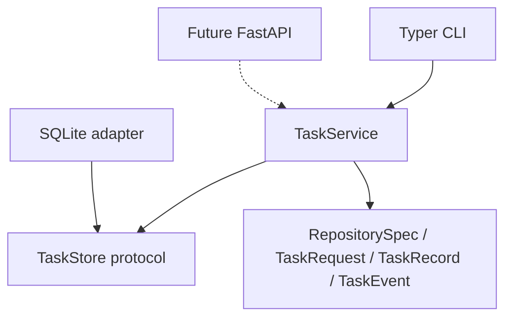
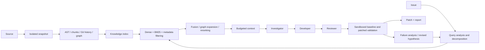

# Architecture

## M1 implemented boundary

RepoAgent is a standalone Python application. Targets are inputs, never part of
its installed package. The CLI calls `TaskService`, which depends on the
`TaskStore` protocol. The composition root constructs `SQLiteTaskStore` lazily.
Pydantic models are immutable, reject unexpected fields, and serialize task
identities and UTC timestamps. No target code is imported or executed.

Settings come from explicit constructor values, process environment, an explicitly
selected dotenv file, then defaults. Startup/help do not initialize dependencies.
Provider/network work will become async; the current local service is synchronous.
No orchestration framework or large manager class is needed in M1.

### Task storage contract

- `create(request) -> TaskRecord`: persist a pending task and sequence-1 creation
  event in one transaction.
- `get(id) -> TaskRecord`: return the stored record or raise `TaskNotFound`.
- `transition(id, status, event, message) -> TaskRecord`: validate the current
  status, then atomically update the task and append a monotonically numbered event.
- `events(id) -> list[TaskEvent]`: return ordered events; reject unknown tasks.

Pending tasks may become running, blocked, or failed. Running tasks may become
succeeded, blocked, or failed. Terminal states cannot transition. M1 commands create
pending tasks and immediately block them with a capability explanation. Creation
and blocking are separate transactions; a process interruption between them can
leave a pending record. There is no background executor or recovery worker in M1.

SQLite schema version 1 has `tasks(id, record)` and
`events(task_id, sequence, record)` tables. Records are typed JSON, event keys are
unique per task, and task IDs are foreign keys. Each operation owns/closes its
connection; writes use `BEGIN IMMEDIATE` and rollback on failure. Initialization is
transactional. Unknown versions and nonempty unversioned databases are rejected.
Historical reads do not require the original local source to still exist.

A future storage adapter can use PostgreSQL/pgvector. Large artifact files should
be stored separately with references from metadata. No migration framework,
encryption, access-control server, or retention policy is implemented yet.

## Planned engine

The graph records containment, imports, inheritance, references and statically
identifiable calls. Preserve unresolved targets rather than inventing relationships.
Use language analyzers behind a protocol; Python starts with the standard AST.
Chunks follow functions, methods, classes, module sections and documentation
sections, with bounded splitting only when a structural unit exceeds the budget.

Retrieval strategies are A vector-only, B BM25-only, C vector+BM25,
D vector+BM25+reranking, E D+graph expansion. Fuse ranked candidates with reciprocal
rank fusion, preserving component scores and provenance. Use the same labeled tasks
and context budget for experiments; ground truth never enters agent context.

### Planned models and interfaces (not runtime implementations)

| Component | Contract / exchanged objects |
| --- | --- |
| Repository source | `materialize(RepositorySpec) -> RepositorySnapshot`; isolated workspace, stable repository ID and selected commit. |
| Language analyzer | `analyze(snapshot) -> analysis`; `SourceSpan`, `Symbol`, `GraphEdge`, `CodeChunk` with file, symbol type, lines, parent, imports, dependencies, language and commit. |
| Embeddings | `embed(texts) -> vectors`; provider/model identity and vector dimension travel with the index. |
| Vector store | `upsert(chunks, vectors)` and `search(query_vector, filters, k)` returning scored IDs. |
| Lexical retrieval | `index(chunks)` and `search(query, filters, k)` returning scored IDs. |
| Reranker | `rerank(query, candidates) -> RetrievalHit[]`; preserve evidence identifiers. |
| Context engine | `ContextBundle` with issue, retrieved evidence, tests, history, prior hypotheses/patches/failures, and `TokenUsage`. |
| LLM provider | `generate(request, output_schema) -> validated result + usage`; vendor-independent structured input/output. |
| Engineering agents | `Investigation`, `Hypothesis`, `PatchArtifact`, `ReviewDecision`, `Attempt`; concise claims, source evidence, decisions and tool results. |
| Sandbox | `run(ExecutionRequest) -> ExecutionResult`; structured allowed command, limits, sanitized environment and workspace. |
| Validation | `ValidationReport`; baseline and patched test IDs/results, new failures, lint, coverage availability and time. |
| Benchmark adapter | `load_tasks() -> BenchmarkTask[]`; normalized task input and separately held evaluator labels. |
| Evaluation | `EvaluationResult`; actual metrics with provenance, dataset revision, configuration and unavailable-value markers. |

Add these models and protocols when their milestones need them. Provider SDKs,
vector engines, queue infrastructure, API and dashboard are intentionally absent
from M1. The first model adapter will be OpenAI-compatible; Anthropic/Gemini and
other adapters can implement the same contract without core changes.

## Safety and technical risks

- Target repositories, issues and docs are untrusted data, never system instructions.
  Context must identify provenance and separate evidence from agent instructions.
- Ingestion must handle `.gitignore`, generated/vendor files, large/binary content,
  symlinks and traversal. Never check out or patch the original repository.
- Target builds/tests require Docker or a stronger sandbox, restricted mounts,
  non-root execution, dropped capabilities, no host secrets, resource/time limits,
  and cleanup. The model cannot request arbitrary shell commands.
- Separate controlled dependency preparation from network-disabled test execution;
  retain image/dependency provenance for baseline and patched runs.
- Compare complete baseline/patched results. A single repaired failing test cannot
  establish regression-free success. Distinguish setup errors, timeouts and absent
  coverage. The >85% gate applies to RepoAgent development, not arbitrary targets.
- Retry using new failure evidence, retrieval queries and hypotheses; cap attempts
  and context expenditure. Do not repeatedly send an unchanged prompt.
- Logs contain only timestamp, level, event, task ID, kind and status. Persist public
  summaries and evidence, not hidden reasoning. Task inputs remain local data.
- Evaluation must distinguish missing labels from zero/success, retain raw run
  provenance, and never report fabricated or copied benchmark results.

## Legacy implementation assessment

Inspected the sibling `ex04-graphify-agentic-debugging` implementation as a reference.
No files or benchmark outputs were copied, imported, or modified.

Its `suspect_ranking.py` offers deterministic BFS, centrality and proximity concepts
for M4. Generalize label-based IDs, direction, graph schemas, disconnected nodes,
and evidence handling before reuse. Its token helpers offer accounting ideas for
M5; distinguish estimates from provider-reported usage.

Its API gatekeeper offers configurable rate limits and concurrency ideas for M5.
Replace broad exception retries with bounded transient-error handling and validate
fairness/concurrency behavior. Do not claim strict FIFO behavior without tests.

Discard hardcoded `foo()` seeds, preserved bug snapshots, fallback diagnoses,
repository-global paths, and host `subprocess` verification. These violate the
unfamiliar-repository and isolation goals. LangGraph is not required for this
foundation; revisit orchestration tooling only when a demonstrated need arises.
