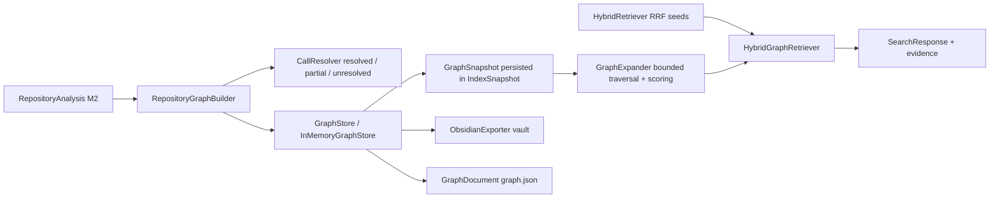
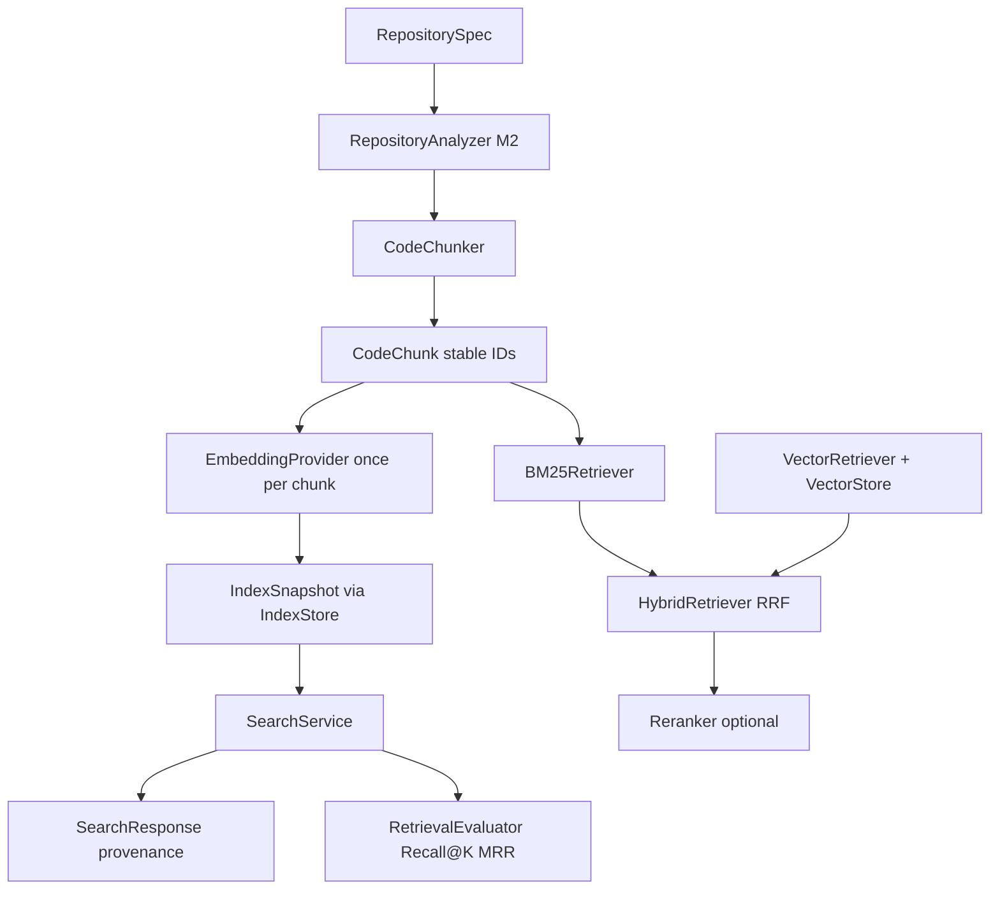
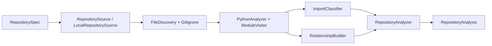
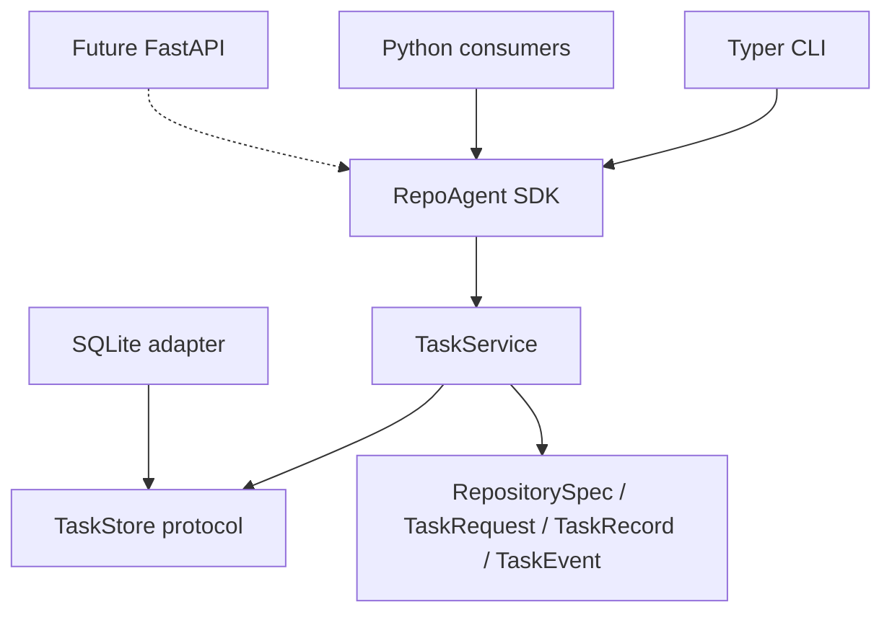
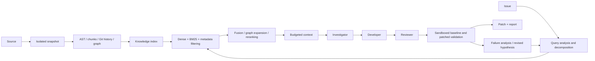
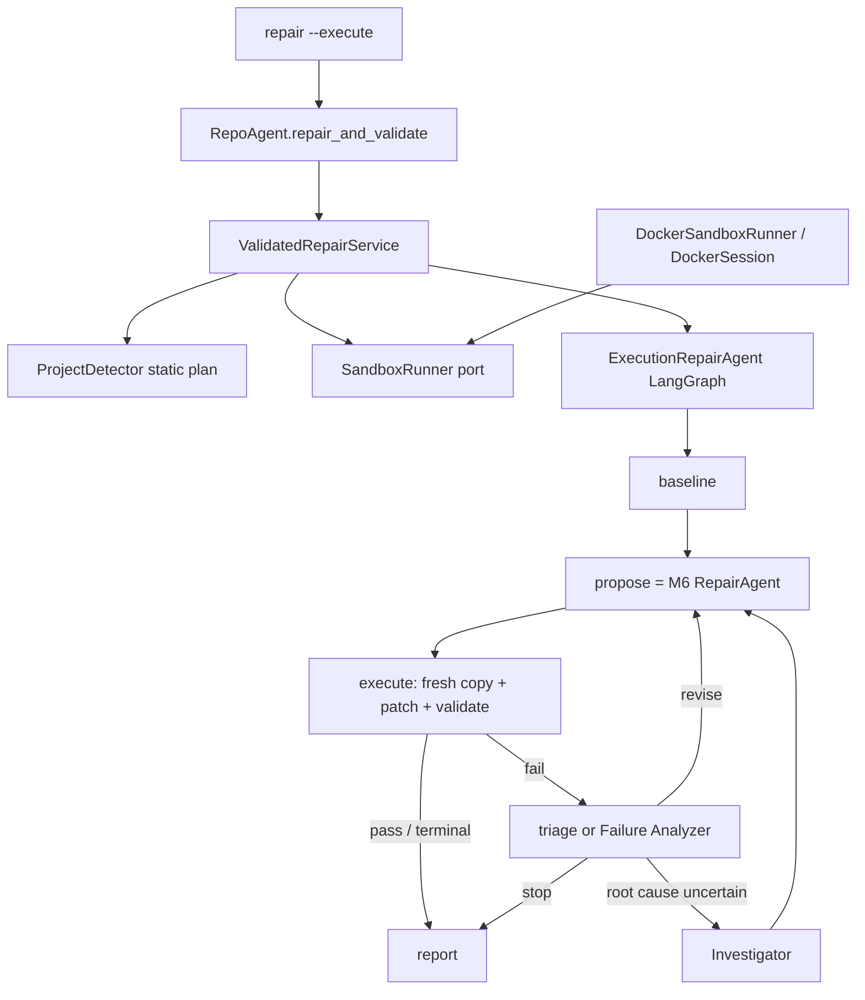
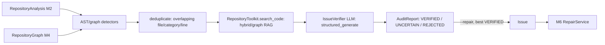
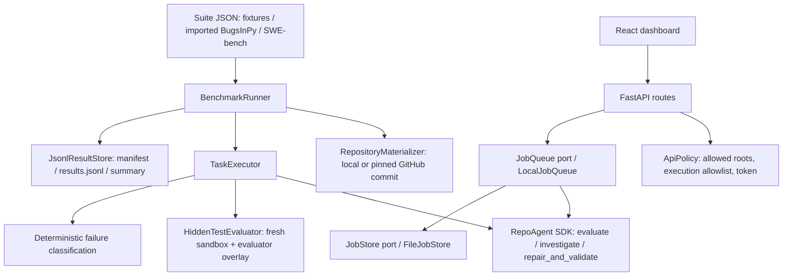
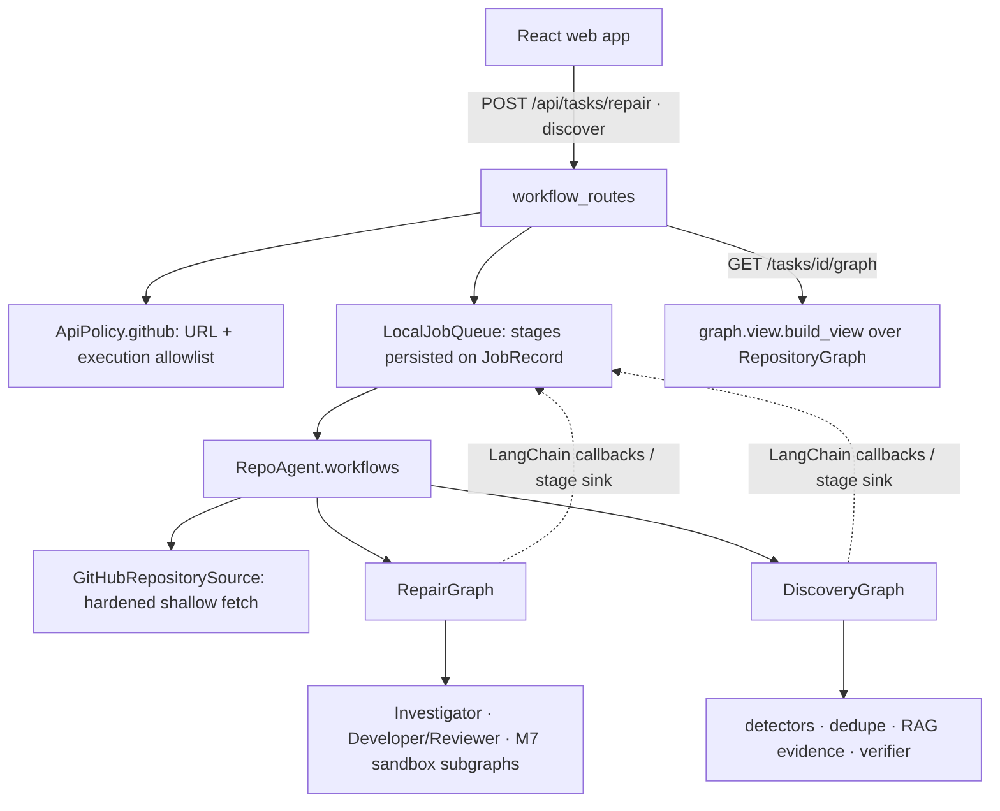

# Architecture

## M4 code knowledge graph

- `graphify` (CLI, SDK `RetrievalApi.graphify`) analyzes and builds the
  graph exactly once, then optionally persists it via two independent,
  additive outputs: `graph.json` (`graph.serializer`, versioned with
  `schema_version` and file/symbol/relationship metadata) and an Obsidian
  vault. `GraphifyService` is the only orchestrator of that shared build;
  the existing `graph`/`export-obsidian` CLI commands and
  `RetrievalApi.graph`/`export_obsidian` are unchanged and still build
  independently for their single-purpose use. `graph.json` round-trips
  through `document_to_snapshot` without re-analyzing the repository.

- Node identity is the qualified name; nodes carry file, line span, parent,
  module, and the linked chunk ID. Edges are typed (DEFINES, CONTAINS,
  IMPORTS, INHERITS, CALLS) and mark `resolved: false` for ambiguous
  targets instead of inventing certainty.
- CALLS edges come from raw call sites recorded by the M2 visitor and
  resolved conservatively: `self.x()` against the caller's class; bare
  names via the same module or a unique repository-wide simple name;
  dotted calls via unique qualified suffix. Ambiguous names stay partial;
  unknown targets produce no edge.
- Traversal is breadth-first with hard bounds (`max_depth`, `max_nodes`,
  edge-type allowlists); a visited set makes cycles harmless; every result
  records graph distance and the relationship path.
- Graph candidates are scored `seed_rank_weight × decay^(distance-1) ×
  min(edge weights)` — deterministic and independently testable.
- `HybridGraphRetriever` reuses the shared `rrf_fuse` implementation for
  both the seed fusion and the seed/graph fusion, so no ranking logic is
  duplicated. Evidence on each result distinguishes bm25 rank, vector
  rank, hybrid seed rank, and graph distance/path.
- The `ObsidianExporter` renders the graph (the source of truth) into a
  deterministic Markdown vault. Note names are sanitized; distinct node IDs
  that sanitize alike get a deterministic `-2`, `-3`, ... suffix
  (`export.notes.build_filenames`) so no note is silently overwritten;
  wikilinks exist only for real, resolved relationships and always match
  the assigned filename; repository text is confined to code spans and
  injection-safe fences; exports never delete and require explicit
  overwrite intent for non-empty destinations.

## M3 retrieval pipeline

`repoagent index` and `repoagent search` run a separated retrieval pipeline:

- `CodeChunker` turns M2 symbols into chunks aligned with functions, methods,
  and module-level code. Class chunks keep the class preamble (header,
  docstring, attributes) without duplicating nested symbol bodies, so source
  is never stored twice. Chunk identity is a SHA-256 of repository, file,
  qualified symbol, and source hash — deterministic and cache-friendly.
- `BM25Retriever` implements Okapi BM25 over `search_text` (path, qualified
  name, docstring, source) with identifier-aware tokenization: snake_case and
  CamelCase split into subtokens while the whole identifier is preserved.
- `EmbeddingProvider` is a vendor-independent protocol; the configured
  default is `HashingEmbeddingProvider` (hashed tokens + character trigrams,
  deterministic and offline). `VectorStore` is a protocol implemented by the
  in-memory `LocalVectorStore` (cosine, deterministic tie-breaks); a pgvector
  or Qdrant adapter can replace it without touching retrieval code.
- `HybridRetriever` fuses rankings with Reciprocal Rank Fusion
  (`1/(k + rank)` per retriever), never mixing raw score scales; ties break
  by chunk ID. `KeywordOverlapReranker` optionally reorders candidates.
- `IndexService` embeds every chunk exactly once per indexing run and
  persists an `IndexSnapshot` (chunks + vectors + provider identity) through
  the `IndexStore` port (`JsonIndexStore` adapter, atomic writes). Searches
  load the snapshot, rebuild the in-memory retrievers, and embed only the
  query. Provider/dimension mismatch fails loudly; no silent strategy
  fallback.
- `RetrievalEvaluator` runs real searches per strategy over labeled
  `RetrievalCase` data and computes Recall@K, MRR, HitRate@K, and
  Precision@K — no LLM involved, no hardcoded numbers. Logs use structured
  events only; no repository content or queries are logged.

## M2 analysis pipeline

`repoagent analyze <path>` runs a separated pipeline, each stage independently
testable and replaceable:

- `RepositorySource` materializes a validated `RepositorySpec` into a local
  tree; a future Git source can implement the same protocol without touching
  the analyzer. Unreadable directories raise `RepositoryInvalid`.
- `FileDiscovery` walks deterministically, skips ignored directories
  (`.git`, `.venv`, `node_modules`, `dist`, `build`, caches), honors
  `.gitignore` per directory (comments, negation, dir-only, anchored,
  `*`/`?`/`**` patterns), and never follows symlinks outside the root.
- `PythonAnalyzer` parses each file once with the standard `ast` module;
  `ModuleVisitor` emits typed `CodeSymbol` values (module/class/function/
  method, parameters, annotations, decorators, docstrings, line ranges).
  Target code is never imported or executed. Syntax, encoding, size, and
  read failures become per-file `FileError` records.
- `ImportClassifier` conservatively labels imports internal, stdlib
  (`sys.stdlib_module_names`), external, or unknown (relative imports that
  cannot be confirmed).
- `RelationshipBuilder` emits only statically verifiable `Relationship`
  edges: imports, inherits (resolved when unambiguous), contains, defines.
- `RepositoryAnalyzer` composes the stages and returns a frozen
  `RepositoryAnalysis` with computed counts, symbols, imports, errors,
  detected tests, configuration files, and relationships. `render.py`
  holds presentation text for the CLI; analysis never depends on CLI code.
  Results contain no timestamps and are deterministic across runs.

## M1 implemented boundary

RepoAgent is a standalone Python application. Targets are inputs, never part of
its installed package. The CLI calls the public `RepoAgent` SDK facade, which composes `TaskService`.
The service depends on the `TaskStore` protocol. The SDK composition root
constructs `SQLiteTaskStore` lazily or accepts an injected store.
Pydantic models are immutable, reject unexpected fields, and serialize task
identities and UTC timestamps. No target code is imported or executed.

Settings come from explicit constructor values, process environment, an explicitly
selected dotenv file, then defaults. Startup/help do not initialize dependencies.
Provider/network work will become async; the current local service is synchronous.
No orchestration framework or large manager class is needed in M1.

OOP represents concrete responsibilities: the SDK exposes the public use cases,
`TaskService` owns task behavior, `SQLiteTaskStore` owns persistence, and typed
models carry validated data. Composition and the storage protocol provide
extensibility without requiring inheritance. Pure validation/formatting utilities
remain functions. See [SDK contracts](sdk.md).

### Task storage contract

- `create(request) -> TaskRecord`: persist a pending task and sequence-1 creation
  event in one transaction.
- `get(id) -> TaskRecord`: return the stored record or raise `TaskNotFound`.
- `transition(id, status, event, message) -> TaskRecord`: validate the current
  status, then atomically update the task and append a monotonically numbered event.
- `events(id) -> list[TaskEvent]`: return ordered events; reject unknown tasks.

Pending tasks may become running, blocked, or failed. Running tasks may become
succeeded, blocked, or failed. Terminal states cannot transition. M1 commands create
pending tasks and immediately block them with a capability explanation. Creation
and blocking are separate transactions; a process interruption between them can
leave a pending record. There is no background executor or recovery worker in M1.

SQLite schema version 1 has `tasks(id, record)` and
`events(task_id, sequence, record)` tables. Records are typed JSON, event keys are
unique per task, and task IDs are foreign keys. Each operation owns/closes its
connection; writes use `BEGIN IMMEDIATE` and rollback on failure. Initialization is
transactional. Unknown versions and nonempty unversioned databases are rejected.
Historical reads do not require the original local source to still exist.

A future storage adapter can use PostgreSQL/pgvector. Large artifact files should
be stored separately with references from metadata. No migration framework,
encryption, access-control server, or retention policy is implemented yet.

## Planned engine

The graph records containment, imports, inheritance, references and statically
identifiable calls. Preserve unresolved targets rather than inventing relationships.
Use language analyzers behind a protocol; Python starts with the standard AST.
Chunks follow functions, methods, classes, module sections and documentation
sections, with bounded splitting only when a structural unit exceeds the budget.

Retrieval strategies are A vector-only, B BM25-only, C vector+BM25,
D vector+BM25+reranking, E D+graph expansion. Fuse ranked candidates with reciprocal
rank fusion, preserving component scores and provenance. Use the same labeled tasks
and context budget for experiments; ground truth never enters agent context.

### Planned models and interfaces (not runtime implementations)

| Component | Contract / exchanged objects |
| --- | --- |
| Repository source | `materialize(RepositorySpec) -> RepositorySnapshot`; isolated workspace, stable repository ID and selected commit. |
| Language analyzer | `analyze(snapshot) -> analysis`; `SourceSpan`, `Symbol`, `GraphEdge`, `CodeChunk` with file, symbol type, lines, parent, imports, dependencies, language and commit. |
| Embeddings | `embed(texts) -> vectors`; provider/model identity and vector dimension travel with the index. |
| Vector store | `upsert(chunks, vectors)` and `search(query_vector, filters, k)` returning scored IDs. |
| Lexical retrieval | `index(chunks)` and `search(query, filters, k)` returning scored IDs. |
| Reranker | `rerank(query, candidates) -> RetrievalHit[]`; preserve evidence identifiers. |
| Context engine | `ContextBundle` with issue, retrieved evidence, tests, history, prior hypotheses/patches/failures, and `TokenUsage`. |
| LLM provider | `generate(request, output_schema) -> validated result + usage`; vendor-independent structured input/output. |
| Engineering agents | `Investigation`, `Hypothesis`, `PatchArtifact`, `ReviewDecision`, `Attempt`; concise claims, source evidence, decisions and tool results. |
| Sandbox | `run(ExecutionRequest) -> ExecutionResult`; structured allowed command, limits, sanitized environment and workspace. |
| Validation | `ValidationReport`; baseline and patched test IDs/results, new failures, lint, coverage availability and time. |
| Benchmark adapter | `load_tasks() -> BenchmarkTask[]`; normalized task input and separately held evaluator labels. |
| Evaluation | `EvaluationResult`; actual metrics with provenance, dataset revision, configuration and unavailable-value markers. |

Add these models and protocols when their milestones need them. Provider SDKs,
vector engines, queue infrastructure, API and dashboard are intentionally absent
from M1. The first model adapter will be OpenAI-compatible; Anthropic/Gemini and
other adapters can implement the same contract without core changes.

## Safety and technical risks

- Target repositories, issues and docs are untrusted data, never system instructions.
  Context must identify provenance and separate evidence from agent instructions.
- Ingestion must handle `.gitignore`, generated/vendor files, large/binary content,
  symlinks and traversal. Never check out or patch the original repository.
- Target builds/tests require Docker or a stronger sandbox, restricted mounts,
  non-root execution, dropped capabilities, no host secrets, resource/time limits,
  and cleanup. The model cannot request arbitrary shell commands.
- Separate controlled dependency preparation from network-disabled test execution;
  retain image/dependency provenance for baseline and patched runs.
- Compare complete baseline/patched results. A single repaired failing test cannot
  establish regression-free success. Distinguish setup errors, timeouts and absent
  coverage. The >85% gate applies to RepoAgent development, not arbitrary targets.
- Retry using new failure evidence, retrieval queries and hypotheses; cap attempts
  and context expenditure. Do not repeatedly send an unchanged prompt.
- Logs contain only timestamp, level, event, task ID, kind and status. Persist public
  summaries and evidence, not hidden reasoning. Task inputs remain local data.
- Evaluation must distinguish missing labels from zero/success, retain raw run
  provenance, and never report fabricated or copied benchmark results.

## Legacy implementation assessment

Inspected the sibling `ex04-graphify-agentic-debugging` implementation as a reference.
No files or benchmark outputs were copied, imported, or modified.

Its `suspect_ranking.py` offers deterministic BFS, centrality and proximity concepts
for M4. Generalize label-based IDs, direction, graph schemas, disconnected nodes,
and evidence handling before reuse. Its token helpers offer accounting ideas for
M5; distinguish estimates from provider-reported usage.

Its API gatekeeper offers configurable rate limits and concurrency ideas for M5.
Replace broad exception retries with bounded transient-error handling and validate
fairness/concurrency behavior. Do not claim strict FIFO behavior without tests.

Discard hardcoded `foo()` seeds, preserved bug snapshots, fallback diagnoses,
repository-global paths, and host `subprocess` verification. These violate the
unfamiliar-repository and isolation goals. LangGraph is not required for this
foundation; revisit orchestration tooling only when a demonstrated need arises.

## Source layout and packaging

Implementation directories (`sdk`, `application`, `domain`, `ports`, `adapters`,
`analysis`, and `cli`) live directly under `src/`. Setuptools maps the installed
`repoagent` package to that source directory through `package-dir` in
`pyproject.toml`, including editable installs. Public imports and the console
entry point remain `repoagent`. Add new subpackages to the explicit package list
when creating them. The package includes `py.typed`; `build/` and distribution
output are ignored.

## M5 implemented investigation

The SDK now composes a LangGraph Investigator with existing hybrid/graph search,
provider-neutral structured outputs, official Groq/OpenAI adapters, and a bounded
read-only toolkit. Conditional edges support evidence refinement and hypothesis
challenge loops. Domain models remain independent of LangGraph and vendor SDKs.
Final reports and observable traces persist as JSON artifacts outside the target
repository; the M1 SQLite lifecycle remains separate. See
[M5 architecture](m5-investigation.md) for state, nodes, contracts, budgets,
security boundaries, validation, and inherited limitations. Repair remains M6.

## M7 implemented sandboxed validation and repair loop

- **Layers.** `domain/sandbox.py`, `domain/validation.py`, and
  `domain/repair_execution.py` hold framework-free contracts (`CommandSpec`,
  `SandboxLimits`, `CommandResult`, `ValidationResult`, `TestFailure`,
  `RepairAttempt`, `FailureAnalysis`, `RepairMetrics`, `ValidatedRepairReport`).
  `ports/sandbox.py` defines `SandboxRunner`/`SandboxSession`. `validation/` is
  deterministic and Docker-free (detection, command policy, parsers, evaluator).
  `sandbox/` contains all Docker/process/filesystem specifics.
- **Reuse.** The `propose` node runs the complete M6 Developer → static validator
  → Reviewer graph, now accepting bounded `runtime_validation_feedback`.
  `StaticPatchValidator.apply` returns patched contents and is reused by
  `WorkspacePatcher` against the disposable copy. Re-investigation reuses
  `InvestigationService` with the original issue plus the runtime observation.
- **Session model.** One session per repair prepares dependencies once (separate
  networked container without the repository), then each baseline/attempt run
  creates a fresh workspace, applies the patch, runs allowlisted commands with
  `--network none`, fingerprints the original repository, and destroys the copy.
- **Bounds.** `RepairLoopLimits` caps attempts, review revisions, and
  re-investigations and derives the LangGraph recursion limit. Any terminal
  `status` routes straight to `report`. Identical diffs stop the loop; identical
  failure signatures reuse the previous analysis without an LLM call.
- **Truthful status.** The reporter downgrades any `VALIDATED` state lacking a
  passing patched validation. Reports persist at `<data-dir>/repairs/<UUID>.json`.

## Repository audit: issue discovery

- `repoagent audit` (CLI, SDK `RepoAgent.audit`) discovers candidate issues in
  an unseen repository instead of starting from a known one. `AuditService`
  (`application/audit.py`) sequences: `default_detectors()`
  (`audit/detectors/`) over an `AuditContext` wrapping the M2
  `RepositoryAnalysis` and the M4 `RepositoryGraphBuilder` store (no second
  graph); `audit.dedupe.deduplicate` (overlapping file/category/line ranges
  collapse to the higher-confidence candidate); `attach_evidence`
  (`application/audit_evidence.py`), which indexes the repository if needed
  and reuses `RepositoryToolkit.search_code` for bounded, provenance-carrying
  evidence (never whole files); and `verify_candidates`
  (`application/audit_verification.py`), which calls `IssueVerifier`
  (`agent/audit_verifier.py`) once per candidate via the shared
  `structured_generate` helper, the same pattern `ReviewerAgent` uses.
- Detectors are deterministic and LLM-free: broad/bare exception swallowing,
  mutable default arguments, unguarded `None`-default parameter access,
  unclosed `open()`, risky `subprocess`/`os` shell usage, unreachable code,
  TODO/FIXME/XXX/HACK markers, circular module imports (DFS over graph
  `IMPORTS` edges), and fan-in/fan-out coupling thresholds. A Ruff adapter
  (`audit/detectors/ruff_adapter.py`) only participates when a `SandboxRunner`
  is injected and the target already configures Ruff (`ProjectDetector`,
  reused unmodified); it installs only Ruff (`DependencyStrategy.TOOLS`) and
  parses output with the existing `parse_ruff`. The default static audit
  executes no target commands at all.
- `VerifierOutput` (`ai/audit_models.py`) is a bounded, `extra="forbid"`
  structured schema like the M6 `ReviewerOutput`: a terminal status
  (`verified`/`uncertain`/`rejected`), concise reasoning, supporting/
  contradicting evidence, confidence, and a recommended follow-up check — no
  hidden chain-of-thought. Malformed verifier output is reported `UNCERTAIN`
  with an observable reason rather than dropped or promoted.
- `--repair` converts the highest-confidence `VERIFIED` candidate into the
  existing `Issue` model (`CandidateIssue.to_issue`) and calls the unchanged
  `RepairService` (`application/audit_repair.py`) — no second repair
  implementation, and nothing repairs automatically unless requested.
  `AuditMetrics` records candidates generated/by-source, duplicates removed,
  verified/uncertain/rejected counts, verification LLM calls/tokens/duration,
  and the repair outcome, for later detector precision measurement.

## M8 implemented benchmarking, API, and dashboard

- `src/benchmark/` sits outside the core agent. It calls only the public SDK
  and never adds agent behavior. Labels, gold patches, and hidden tests are
  used only after the agent finishes.
- Ablations use `RepairFeatures` flags on existing components: graph retrieval
  on or off in `InvestigateRequest`, a reviewer bypass in `RepairAgent` (static
  validation still decides), a single investigation iteration, and one attempt
  with no re-investigation.
- `CountingProvider` records provider-reported tokens, prompt characters, and
  calls per stage; repair metrics include them. Prompt contexts send focused,
  deduplicated evidence without internal identifiers.
- `SandboxSession.run(..., overlay=...)` lets evaluators add hidden test files
  inside the disposable copy. Agents never supply overlays.
- The API is a thin transport. Long operations are submitted as jobs with
  observable progress events, and results are stored separately. Graph
  endpoints reuse `graph.inspection`, which is shared with the CLI.
- Chunk IDs use the repository name, not its absolute path, so rankings and
  tie-breaks are identical wherever a benchmark repository is checked out.

## Web workflows: RepairGraph, DiscoveryGraph, GitHub sources

- `WorkflowApi` (`sdk/workflows.py`) composes existing SDK operations; it
  adds repository loading, a `BudgetedProvider`, and progress — not another
  repair, retrieval or sandbox pipeline. `AuditService` now runs discovery
  through `DiscoveryGraph`, so CLI, SDK and web share one implementation.
- Stage progress: `WorkflowProgressHandler` is a LangChain callback handler;
  LangGraph propagates callbacks into graphs invoked inside nodes, so the
  unchanged Investigator/RepairAgent/ExecutionRepairAgent node starts map to
  stages. `workflows/outcomes.py` marks the failing stage from the final
  report status and never upgrades a failure.
- Results are `RepairWorkflowResult` / `DiscoveryWorkflowResult` with a
  `RepositoryHandle` (source URL, commit, workspace path). The graph endpoint
  rebuilds the native graph from that snapshot; the discovery → repair
  handoff reuses the same handle, so both analyze identical code.
